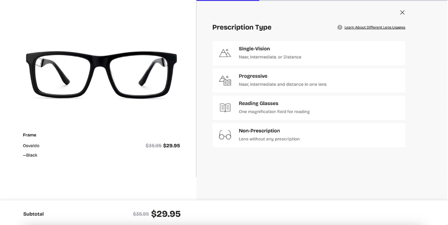
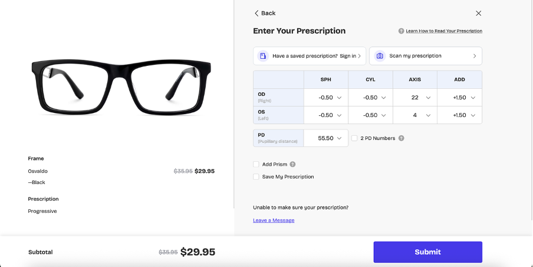
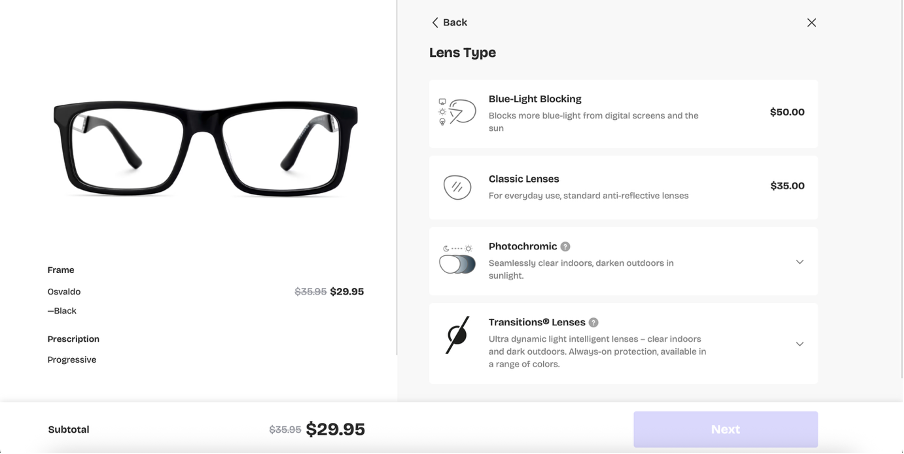
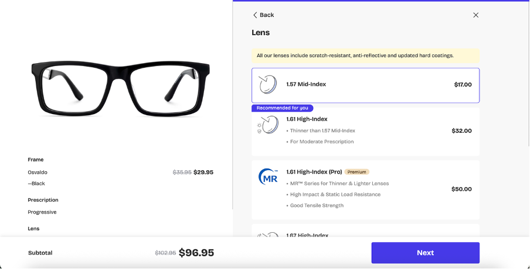
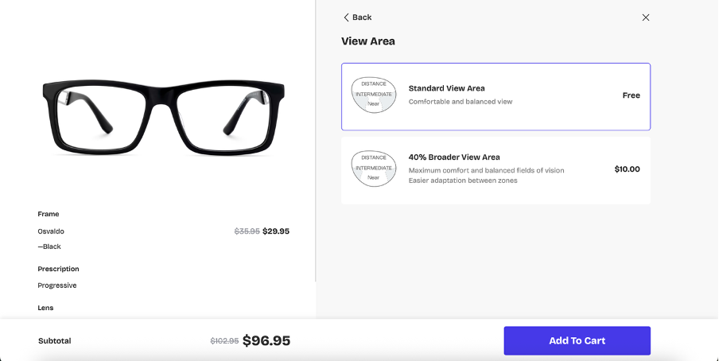

🕶️ Prescription Flow — Simplified Overview

1. Step 1: Choose your option

User selects:
•	Frame Only
•	Add Prescription Lenses
 
2. If user selects 
Frame Only

Lens Type Options:
•	Frame Only (Demo Lenses) — No prescription or functional lenses.
•	Blue Light Block — Protects eyes from digital screens.
•	Standard Clear Lenses — Everyday transparent lenses.
•	Photochromatic — Automatically darkens in sunlight.

➡️ Then: Add to cart.
 
3. If user selects 
Add Prescription Lenses

3.1 Choose Prescription Type:
•	Single Vision — One field of vision (near or distance).
•	Progressive — Multiple vision zones in one lens.
•	Non-Prescription — Cosmetic or protective use only.

If Non-Prescription → Follow the same flow as Frame Only (Step 2).
 
4. If user selects 
Single Vision
1.	Enter Prescription (Formula)
2.	Select Lens Type:
o	Blue Light Block
o	Standard Clear
o	Photochromatic
3.	Select Lens Index:
o	Mid-Index
o	High-Index

➡️ Then: Add to cart.
 
5. If user selects 
Progressive
1.	Enter Prescription (Formula)
2.	Select Lens Type:
o	Blue Light Block
o	Standard Clear
o	Photochromatic
3.	Select Lens Index:
o	Mid-Index
o	High-Index
4.	Select View Area:
o	Standard View
o	40% Broader View

➡️ Then: Add to cart.

Tables:
Prescription type
Lens type
Lens Index
View area

Example progressive Flow screenshots: 
Step 1. 

Step 2. 

Step 3. 

Step 4. 

Step 5. 

